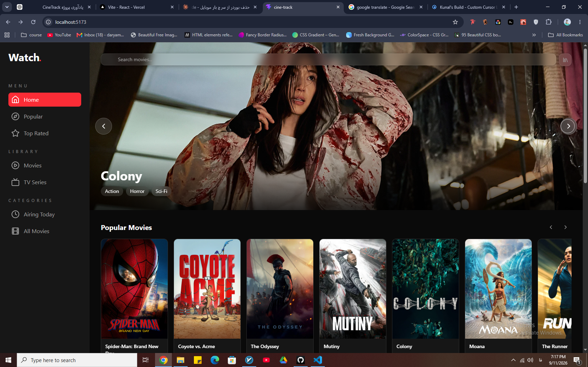

# CineTrack

A movie discovery and tracking web app built with React.

[GitHub Repository](https://github.com/daryamardani14-tech/cine-track) · [Live Demo](https://cine-track.daryamardani14.workers.dev)



## Features

- Browse popular, top-rated, upcoming, and currently playing movies
- Browse TV series and airing today
- Search for movies with live search results
- View detailed movie information
- View cast, director, genres, rating, release date, and runtime
- Add movies to Favorites
- Add movies to Wishlist
- Mark movies as Watched
- Personal library for saved movies
- Dedicated library views for Favorites, Wishlist, and Watched movies
- Responsive layout for desktop, tablet, and mobile
- Fluid responsive typography
- Mobile navigation and library drawer
- Dark cinematic UI inspired by modern movie dashboards
- Loading and error handling for API requests
- Fallback images for unavailable movie posters
- Toast notifications for library actions
- Scroll position restoration between pages

## Tech Stack

- React
- Vite
- Tailwind CSS
- React Router
- Lucide React
- React Hot Toast
- TMDB API

## Getting Started

Clone the repository and install the dependencies:

```bash
npm install
```

Create a `.env` file in the project root and add your TMDB token:

```env
VITE_TMDB_TOKEN=your_token_here
```

Start the development server:

```bash
npm run dev
```

The app will be available at the local address shown in the terminal.

## Build

To create a production build:

```bash
npm run build
```

The production files will be generated in the `dist` folder.

## Deployment

CineTrack is deployed using Cloudflare Workers.

## API

Movie and TV data is provided by [The Movie Database (TMDB)](https://www.themoviedb.org/).

This project is not affiliated with or endorsed by TMDB.

## Project Status

CineTrack is a portfolio project built to demonstrate React development, API integration, responsive UI design, client-side routing, state management, and local data persistence.

The project is feature-complete, with room for future UI and UX improvements.

## License

This project is for learning and portfolio purposes.
